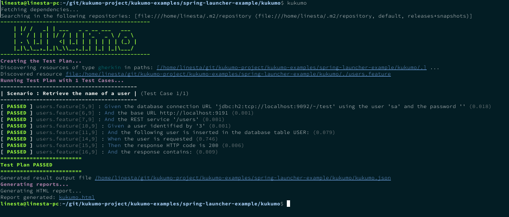

<p align="center"></p>

## Overview

> The content of this document is a very brief presentation of the overall concept. In order to get further 
explanation or the specifics, check the documentation inside each component.

Kukumo is a Cucumber-inspired automatic testing tool written in Java. 

Just like Cucumber, you can define your tests using 
natural, human-readable language by adopting (for example) the Gherkin _grammar_. However, with Kukumo you
 _do not_ bind each step to your test code; instead, steps are bound to reusable, 
common-purpose code provided by external plugins. Thus, Kukumo turns out to be a convenient tool if your aim is 
test your system via standarized accesses such as 
REST web services or JDBC connection, which tend to be a great deal of percentage of the tests written for most 
of applications. **No test code is required to be written**, so even non-programmers can define and execute 
their own tests.

Other features provided by Kukumo are:

- **Alternative launchers**: execute Kukumo as a JUnit test suite, as a Maven verify goal, or directly as 
a console command.
- **Fully internationalizable**: you can use your own language as long as you provided Kukumo with a translation file  
- **Easily extensible**: write your own plugins for any extension point (steps, reporters, language parsers, etc.) 
and share them with the community
- **Not only Gherkin**: Gherkin feature files are the initial test definition source implemented, 
but it is not internally bound to Kukumo; any plugin can provide other ways to collect the test definitions to be used


> **REMEMBER**  
> Kukumo is a _tool_, not a _testing framework_. Use it when fits the circumstances. Neither is it 
a replacement for Cucumber: according your necessities, you can use _both_!    


## Usage  
 
Running tests with Kukumo is very easy. Just write your test specification, 
define a basic configuration with the step providers (and any other plugin) that you require,
and choose the launcher that fits better your project.

Let's assume a RESTful application that exposes a service that allows to retrieve 
data about users. Internally, data is stored in a database table named `USER`. Given 
that, we want to test that the name of the users is retrieved correctly when using the 
REST service.

The following Gherkin specification define a test that use steps from two different plugins, 
`Kukumo::REST` and `Kukumo::Database` (further explanation about them can be found in the documentation of each plugin).

###### users.feature
```gherkin
Feature: Testing the user data retrieval service

    Background:
        Given the database connection URL 'jdbc:h2:tcp://localhost:9092/~/test' using the user 'sa' and the password ''
        And the base URL http://localhost:9191
        And the REST service '/users'
    
    Scenario: Retrieve the name of a user
        Given a user identified by '3' 
        And the following user is inserted in the database table USER:
        | ID | FIRST_NAME | LAST_NAME |
        | 3  | John       | Doe       |
        When the user is requested 
        Then the response HTTP code is 200 
        And the response contains:
        """
         { "firstName": "John" }
        """
```

Now we define the execution configuration, that is simply a set of properties that Kukumo would take 
into account for several aspects. There are several ways to define them; in this example we will just 
write them in the default configuration file `kukumo.yaml`. 

> **INFO**   
> Besides the core functionality properties, each plugin can make use 
of its own set of properties. They all are described in their respective 
documentation.

###### kukumo.yaml
```yaml
kukumo:
    resourceTypes: 
      - gherkin
    modules:
      - iti.kukumo:kukumo-rest:0.9.0
      - iti.kukumo:kukumo-db:0.9.0
      - iti.kukumo:kukumo-html-report:0.9.0
      - com.h2database:h2:1.4.199
    htmlReport:
        output: target/reports/kukumo/html/kukumo-report.html
``` 

The plugins (and other extra libraries) required are defined in the `modules` property, but in the 
case you are working with a Maven project, you can alternatively include them as regular dependencies:

###### pom.xml
```xml
    ...
    <dependencies>
       <dependency>
          <artifactId>iti.kukumo</artifactId>
          <groupId>kukumo-core</groupId> 
          <version>0.9.0</version>
       </dependency>
       <dependency>
          <artifactId>iti.kukumo</artifactId>
          <groupId>kukumo-db</groupId>
          <version>0.9.0</version>
       </dependency>
       <dependency>
          <artifactId>iti.kukumo</artifactId>
          <groupId>kukumo-rest</groupId>
          <version>0.9.0</version>
       </dependency>
    </dependencies>
``` 

One you have configured the test execution, the only thing remaining is run the test plan. There are 
three different ways of launching it (see `Runners` below); in this example, we will use the console 
command launcher. Assuming it is correctly installed, you just have to type:
```
kukumo
```
and the test will be executed.

<p align="center"></p>


The results of the test execution, besides the console output, are stored in an output file, named by default 
```kukumo.json```. Additional plugins can read this file and generate reports or do any other post-execution 
tasks.

[[back to top](#top)]

## Runners

Currently, there are three methods available to launch a test plan, regarding the nature of the project and 
the test approach:

- **Using JUnit**: For Java projects, you can create an empty testing class to be run as a normal JUnit test suite, 
setting the custom JUnit runner ```KukumoJUnitRunner```. This way, the plan is treated 
as a normal JUnit test and will be executed along any other JUnit test existing.

   >  _Use it when..._   
   >  Java applications, if you require report integration with other JUnit tests, or using an IDE
   > to launch tests 
   
    
- **Using Maven**: If your project uses Maven, and you prefer to execute the Kukumo test plan in a separate stage,
you can execute Kukumo attaching the ```kukumo-maven-plugin``` plugin to the 
Maven lifecycle.  Simply configure the Maven plugin and the desired additional Kukumo plugins 
in your POM `build` section.

   >  _Use it when..._   
   >  Maven-built applications, if you want to include Kukumo as a part of the verify phase

- **Stand-alone launcher**: If your project does not use neither JUnit nor Maven, Kukumo provides a 
stand-alone command-line based launcher, that will manage the plugin dependencies internally.

   >  _Use it when..._   
   >  Non-Java applications and/or your test plan is to be executed outside the building process
   
     

[[back to top](#top)]


## Plugins

The following Kukumo plugins are provided as a part of the project:

- **Kukumo::REST Steps**: a set of steps aimed to test RESTful operations. It includes `GET`,`POST`,`PUT`,`PATCH`,
`DELETE` requests, validation of HTTP codes, and validation of response bodies when the content type is JSON, XML, 
or text. 
- **Kukumo::Database Steps**: a set of steps aimed to test database contents via JDBC. It includes data load/comparison 
from several sources such as CSV files, Excel files, and in-document tables.
- **Kukumo::HTML Report**: this plugin creates a dynamic HTML report that shows the results of a test plan execution
- **Kukumo::Spring**: Spring-Boot integration for configuring other plugins like `Kukumo::REST Steps` (using the 
same random port used by Spring for tests) and `Kukumo::Database Steps` (getting the database connection from 
the `DataSource` bean). 

This set of plugins are provided as an initial stage. However, the long-term goal is get an ecosystem with a 
wide range of plugins from third-party contributors covering different needs. 


[[back to top](#top)]


## Other tools

Along with the Kukumo core components, a set of tools have been developed. Rather than being included
inside the core, they are independent general-purpose libraries that can be used in other projects of any nature.
Feel free to use them at your will.

- **Configurer**: library to load property-based configurations from several sources and combine 
them in several ways
- **jExt**: advanced infrastructure for Java plugins (a.k.a _Java extensions_)
- **Maven Fetcher**: library with very convenient methods to retrieve artifacts from a Maven repository
- **SLF4J ANSI**: a simple wrapper over SLF4J that allows use _styles_ (based on ANSI characters) in your 
log parameters   

[[back to top](#top)]


## Contributing

Currently the project is closed to external contributions but this may change in the future.

[[back to top](#top)]


## License

```
MIT License
           
Copyright (c) 2019 - Instituto Tecnológico de Informática www.iti.es

Permission is hereby granted, free of charge, to any person obtaining a copy
of this software and associated documentation files (the "Software"), to deal
in the Software without restriction, including without limitation the rights
to use, copy, modify, merge, publish, distribute, sublicense, and/or sell
copies of the Software, and to permit persons to whom the Software is
furnished to do so, subject to the following conditions:

The above copyright notice and this permission notice shall be included in all
copies or substantial portions of the Software.

THE SOFTWARE IS PROVIDED "AS IS", WITHOUT WARRANTY OF ANY KIND, EXPRESS OR
IMPLIED, INCLUDING BUT NOT LIMITED TO THE WARRANTIES OF MERCHANTABILITY,
FITNESS FOR A PARTICULAR PURPOSE AND NONINFRINGEMENT. IN NO EVENT SHALL THE
AUTHORS OR COPYRIGHT HOLDERS BE LIABLE FOR ANY CLAIM, DAMAGES OR OTHER
LIABILITY, WHETHER IN AN ACTION OF CONTRACT, TORT OR OTHERWISE, ARISING FROM,
OUT OF OR IN CONNECTION WITH THE SOFTWARE OR THE USE OR OTHER DEALINGS IN THE
SOFTWARE.

```

[[back to top](#top)]


## Authors

- **Luis Iñesta Gelabert**

    - linesta@iti.es
    - luiinge@gmail.com