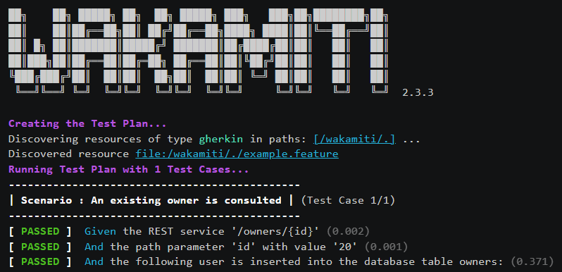

> Please check the [site version](https://iti-ict.github.io/wakamiti/) in case you are 
> reading this document directly from the repository


[](https://hub.docker.com/repository/docker/wakamiti/wakamiti) [](https://sonarcloud.io/project/overview?id=iti-ict_kukumo) [](https://sonarcloud.io/component_measures?metric=tests&view=list&id=iti-ict_kukumo) [](https://sonarcloud.io/component_measures?metric=Coverage&view=list&id=iti-ict_kukumo) [](https://sonarcloud.io/component_measures?metric=sqale_index&view=list&id=iti-ict_kukumo)


Wakamiti is a Cucumber-inspired tool written in Java focused on **blackbox testing**
using **natural language**.

<br/>

Just like Cucumber, you can define your tests using natural, human-readable language by adopting 
(for example) the Gherkin _grammar_. However, with Wakamiti you  _do not_ bind each step to your 
test code; instead, steps are bound to reusable, common-purpose code provided by external plugins. 

<br/>

Thus, Wakamiti turns out to be a convenient tool if your aim is test your system via standardized 
protocols such as REST web services or JDBC connection, which tend to be a great deal of percentage
of the tests written for most applications. This *blackbox-testing* approach allows using Wakamiti
regardless the specific technology used by the target application.

<br/>

Also, **no test code is required to be written**, so even non-programmers can define and execute 
their own tests.

<br/>

Other features provided by Wakamiti are:

- **Two-layered Gherkin**: you can make use of the Gherkin grammar at two levels of abstraction, 
one aimed to customer communication, and other aimed to system details
- **Fully localizable**: you can use your own language as long as you provided Wakamiti with a 
translation file  
- **Easily extensible**: write your own plugins for any extension point (steps, reporters, 
language parsers, etc.) and share them with the community
- **Alternative launchers**: execute Wakamiti as a JUnit test suite, as a Maven verify goal, 
or directly as a console command.


> **REMEMBER**  
> Wakamiti is a _tool_, not a _testing framework_. Use it when fits the circumstances. Neither is it 
a replacement for Cucumber: according your necessities, you might use _both_!    


Usage
----------------------------------------------------------------------------------------------------
 
Running tests with Wakamiti is very easy. Just write your test specification, 
define a basic configuration with the step providers (and any other plugin) that you require,
and choose the launcher that fits better your project.

Let's assume a RESTful application that exposes a service that allows to retrieve 
data about users. Internally, data is stored in a database table named `USER`. Given 
that, we want to test that the name of the users is retrieved correctly when using the 
REST service.

The following Gherkin specification define a test that use steps from two different plugins, 
`REST steps` and `Database steps` (further explanation about them can be found in the 
documentation of each plugin).

###### users.feature
```gherkin
Feature: Testing the user data retrieval service

    Background:
        Given the database connection URL 'jdbc:h2:tcp://localhost:9092/~/test' using the user 'sa' and the password ''
        And the base URL http://localhost:9191
        And the REST service '/users'
    
    Scenario: Retrieve the name of a user
        Given a user identified by '3' 
        And the following user is inserted in the database table USER:
        | ID | FIRST_NAME | LAST_NAME |
        | 3  | John       | Doe       |
        When the user is requested 
        Then the response HTTP code is 200 
        And the response contains:
        """
         { "firstName": "John" }
        """
```

Now we define the execution configuration, that is simply a set of properties that Wakamiti would take 
into account for several aspects. There are several ways to define them; in this example we will just 
write them in the default configuration file `wakamiti.yaml`:

```yaml
# wakamiti.yaml
wakamiti:
    resourceTypes: 
      - gherkin
    modules:
      - es.iti.wakamiti:wakamiti-rest:1.3.1
      - es.iti.wakamiti:wakamiti-db:1.3.1
      - es.iti.wakamiti:wakamiti-html-report:1.3.1
      - com.h2database:h2:1.4.199
    htmlReport:
        output: target/reports/wakamiti/html/wakamiti-report.html
``` 

> In addition to the core functionality properties, each plugin can make use
of its own set of properties. They all are described in their respective
documentation.

Once you have configured the test execution, the only thing remaining is run the test plan. 
There are several ways of launching it (see `Runners` below); in this example, we will use the 
console command launcher. Assuming it is correctly installed, you just have to type:

```shell
wakamiti
```

and the test will be executed.

<br/>



<br/>


The results of the test execution, besides the console output, are stored in an output file, 
named by default ```wakamiti.json```. Additional plugins can read this file and generate reports 
or do any other post-execution tasks.


## Runners

Currently, there are three methods available to launch a test plan, regarding the nature of the project and 
the test approach:

- **Using JUnit**: For Java projects, you can create an empty testing class to be run as a normal JUnit test suite, 
setting the custom JUnit runner ```WakamitiJUnitRunner```. This way, the plan is treated 
as a normal JUnit test and will be executed along any other JUnit test existing.

    _Suitable scenarios_   
   Java applications, if you require report integration with other JUnit tests, or using an IDE
   to launch tests 
   
    
- **Using Maven**: If your project uses Maven, and you prefer to execute the Wakamiti test plan in a separate stage,
you can execute Wakamiti attaching the ```wakamiti-maven-plugin``` plugin to the 
Maven lifecycle.  Simply configure the Maven plugin and the desired additional Wakamiti plugins 
in your POM `build` section.

   _Suitable scenarios_   
   Maven-built applications, if you want to include Wakamiti as a part of the verify phase

- **Stand-alone launcher**: If your project does not use neither JUnit nor Maven, Wakamiti provides a 
stand-alone command-line based launcher, that will manage the plugin dependencies internally.

   _Suitable scenarios_   
   Non-Java applications and/or your test plan is to be executed outside the building process
   
     


Plugins
----------------------------------------------------------------------------------------------------

The following Wakamiti plugins are provided as a part of the project:

- [REST Steps](wakamiti-plugins/wakamiti-rest/target/docsite/index.html): 
a set of steps aimed to test RESTful operations. It includes 
`GET`,`POST`,`PUT`,`PATCH`, and `DELETE` requests, validation of HTTP codes, 
and validation of response bodies when the content type is JSON, XML, or plain text.
- [Database Steps](wakamiti-plugins/wakamiti-db/target/docsite/index.html): 
a set of steps aimed to test database contents via JDBC. 
It includes data load/comparison from several sources such as CSV files, Excel files, 
and in-document tables.
- [AMQP Steps](wakamiti-plugins/wakamiti-amqp/target/docsite/index.html):
a set of steps aimed to test AMQP messaging
- [I/O Steps](wakamiti-plugins/wakamiti-amqp/target/docsite/index.html):
a set of steps to work with local files
- [HTML Report](wakamiti-plugins/wakamiti-html-report/target/docsite/index.html): 
this plugin creates a static HTML report that shows the results of a test plan 
execution.


> This set of plugins are provided as an initial stage and some of them are at an early state. 
> The long-term goal is get an ecosystem with a wide range of plugins from third-party contributors 
> covering different needs. 


Wakamiti Editor
----------------------------------------------------------------------------------------------------

Wakamiti implements the [Language Server Protocol](https://microsoft.github.io/language-server-protocol/)
in order to allow editors to provide auto-completion and validation features. As an example, a 
[Visual Studio Code](https://code.visualstudio.com/) extension is provided 
[here](https://github.com/iti-ict/wakamiti/raw/main/wakamiti-vscode-extension/wakamiti-vscode-extension-latest.vsix).
Check [this section](xxx) to learn more about it.


Contributing
----------------------------------------------------------------------------------------------------

There are several ways in which you can contribute to this project:

### Reporting a defect / requesting a new feature

If you have detected a potential defect, or there is a missing feature that you really would 
need, feel free to open a new issue in the 
[Github page](https://github.com/iti-ict/wakamiti/issues). Please check before that a similar
issue is not already reported.


### Fixing a bug / implementing a feature

If there is any [open issue](https://github.com/iti-ict/wakamiti/issues) that you want to implement,
follow these steps:
1. Fork the [source code](https://github.com/iti-ict/wakamiti)
2. Create a new branch in your forked repository
3. Commit the changes
4. Open a pull request clearly stating the issue that you are attempting to solve
5. Your pull request would be reviewed and subsequently either accepted or rejected. In the later
case, you shall be provided with enough feedback in order to make changes and repeat the request.

> Feel free to engage in a **friendly** discussion if you disagree with the given feedback. 
> Any rude or inappropriate form of communication will be automatically dismissed.


Acknowledgements
----------------------------------------------------------------------------------------------------

This software has been developed as a part of the Plan of Non-Economical Activities of 
**Instituto Tecnológico de Informática (ITI)** for the year 2021, funded by 
**Institut Valencià de Competitivitat Empresarial (IVACE)** and **Generalitat Valenciana**,
by means of the colaboration agreement between IVACE and ITI aimed to enhance their activity 
and capabilities of developing excellence in the matter of independant R&D, spreading 
the results of conducted researches, and driving knowledge transfer among companies from the 
*Comunitat Valenciana*. 


License
----------------------------------------------------------------------------------------------------

```
    Mozilla Public License 2.0

    This Source Code Form is subject to the terms of the Mozilla Public
    License, v. 2.0. If a copy of the MPL was not distributed with this
    file, You can obtain one at https://mozilla.org/MPL/2.0/.
```


Authors
----------------------------------------------------------------------------------------------------

- **Luis Iñesta Gelabert**   linesta@iti.es | luiinge@gmail.com
- **María Galbis**  mgalbis@iti.es
    


