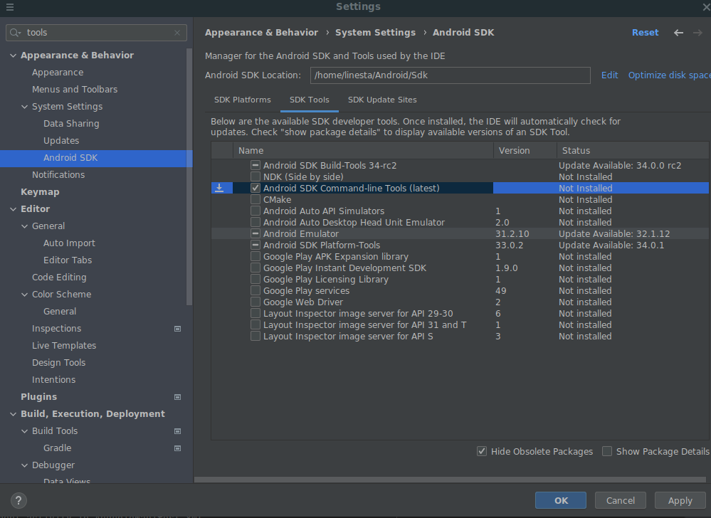

1. Instalar Android SDK
```
  sudo apt install android-sdk
```


2. Agregar la variable de entorno ANDROID_HOME
```
  (p.ej. $HOME/Android/Sdk )
```

3. Instalar cmdline-tools
 


5. Instalar Appium y Appium-doctor
```
   npm install -g appium
   npm install @appium/doctor --location=global
```

4. Comprobar la instalación
```
appium-doctor --android
```
Todo deberia salir como OK, en caso contrario revisar los checks en rojo

5. Arrancar el servidor Appium
```
appium
```
El puerto por defecto es 4723

Descargar APK de prueba en:
https://github.com/appium/appium/raw/1.x/sample-code/apps/ApiDemos-debug.apk

6. Crear un dipositivo Virtual
```
$ANDROID_HOME/cmdline-tools/latest/bin/avdmanager create avd --force --name Nexus6P --abi google_apis_playstore/x86 --package 'system-images;android-30;google_apis_playstore;x86' --device "Nexus 6P"```
```

7. Iniciar el emulador Android
```
$ANDROID_HOME/emulator/emulator -avd Nexus6P
```


Si en algun momento el emulador se queda pillado y dice que ya existe una emulacion en curso, 
se puede limpiar el estado con
```
$ANDROID_HOME/platform-tools/adb kill-server
```


Lo ideal seria poder lanzar todo esto de manera semiautomatica unicamente 
a partir del APK, pero de momento hay que:
- Instalar Android Studio 
- Crear dispositivo virtual (AVD) Por ejemplo Pixel 2 API 30 con Android 11
- Arrancar el AVD con el boton de play

