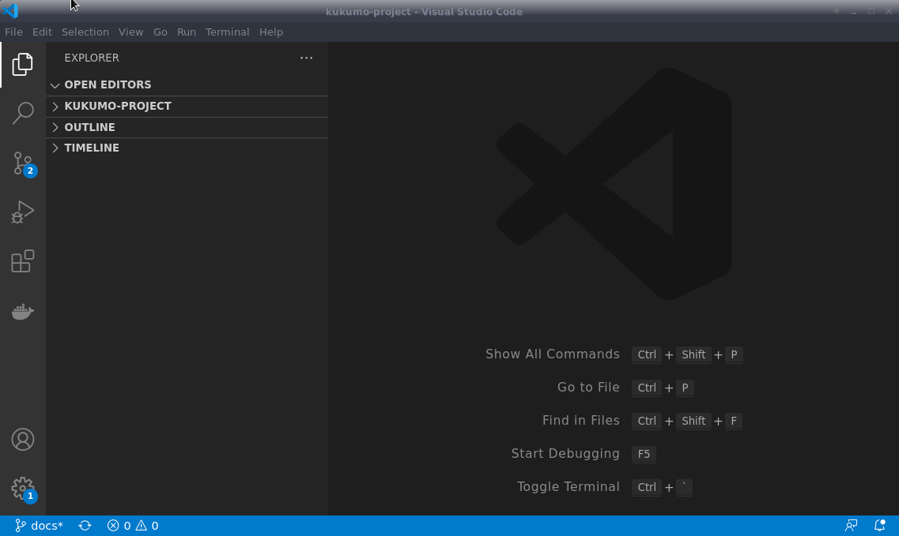
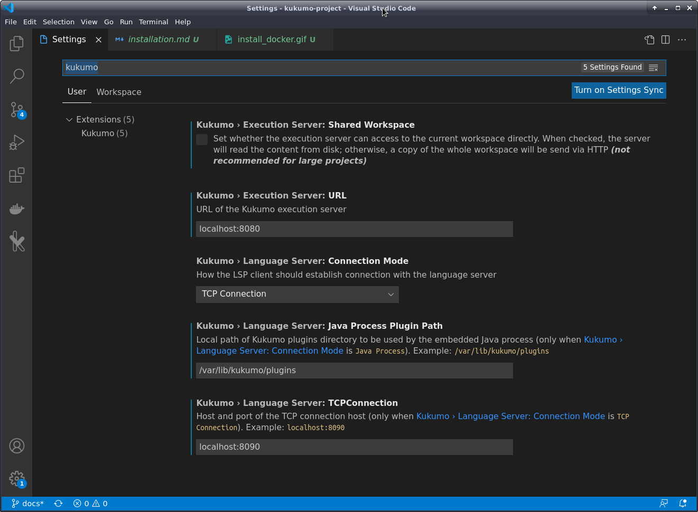
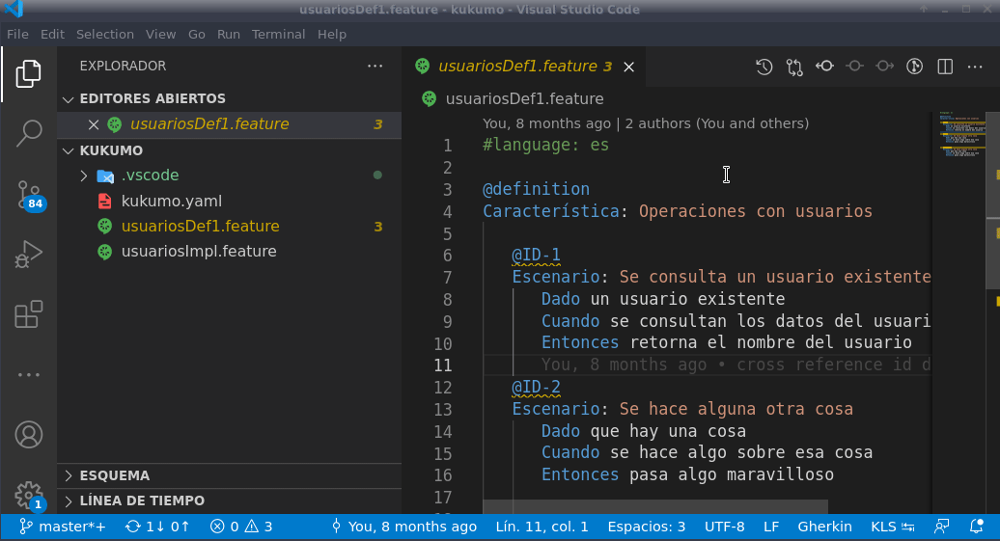
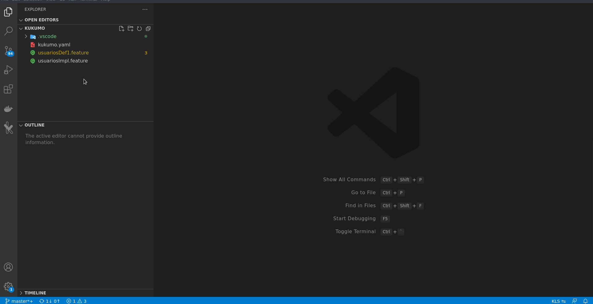
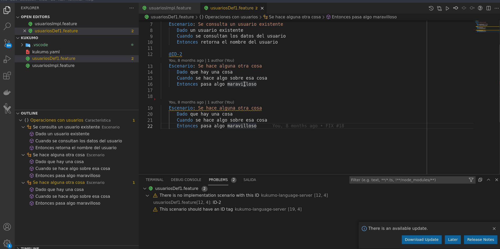

Instalalación
---------------------------------------------------------------------------------------------------
### Descarga e instalación de la extensión empaquetada como VSIX

> Los siguientes pasos requiren que acceso al Gitlab y al servidor Nexus
> del ITI.

1. Instalar Visual Studio Code (en caso de no tenerlo) desde su [sitio web](https://code.visualstudio.com/)
2. Descargar la extensión empaquetada de la siguiente url:
   https://github.com/iti-ict/kukumo/raw/main/kukumo-vscode-extension/kukumo-vscode-extension-latest.vsix
3. . Instalar la extensión:

    1. Ir a la pestaña *Extensions*
    1. Pulsar sobre el botón ```...```
    1. Seleccionar *Install from VSIX...*
    1. Seleccionar el fichero descargado en el paso anterior



### Configurando la extensión

Una vez instalada, hay ciertos parametros de configuración que pueda ser queramos
ajustar. Para ello, pulsar el icono de rueda dentada en la parte inferior izquierda y
seleccionar *Settings* (o pulsar *Ctrl+coma* si usamos los atajos de teclado estándar).
A continuación escribir ```kukumo``` en los filtros.



La configuración por defecto está preparada para funcionar con un servidor de ejecuciones local, pero podemos cambiar las URL de conexión
si queremos usar un servidor remoto.

### Ajustar el modo de lenguaje al abrir archivos

Es posible que en el momento de instalar la extensión, ya tengamos
alguna otra extensión para la edición de archivos Gherkin. De ser así, cuando abramos un archivo (```.feature```) no usará la extensión de Kukumo inicialmente. Podemos detectarlo en la parte derecha de la barra inferior:


En esta circunstancia, deberemos pulsar sobre el texto ```Gherkin```
en la barra, seleccionar la opción *Configure file association...*
y buscar el modo de lenguaje ```Kukumo Gherkin```. Tras
eso, el resto de archivos ```.feature``` ya se cargarán usando Kukumo.




### Instalación del servidor de ejecución

Si no se dispone acceso remoto a un servidor de ejecución, podemos
instalar uno en nuestra propia máquina desde una imagen Docker. Para mayor facilidad usaremos una imagen *all-in-one* que incluye pre-instalados varios plugins.

Para ello:

1. Identficarse en el servidor Nexus del ITI:
   ```
   docker login nexus-kukumo.iti.upv.es
   ```

1. Descargar la imagen y ejecutarla en un contenedor:
   ```
   docker run -d --rm -p 8880:8080 -p 8890:8090 --name kukumo-server-demo nexus-kukumo.iti.upv.es/kukumo-server-demo:latest
   ```
   > Podemos enrutar los puertos a otros diferentes en caso de estar ocupados, pero actualizando la configuración de Kukumo en VS Code


Uso de la extensión VS Code
----------------------------------------------------------------------------------------------------

### Autocompletado de pasos

El principal valor aportado es el autocompletado de *keywords* y pasos.
Se puede invocar con la combinación de teclas definida en VS Code
para tal efecto (por defecto Ctrl+Espacio).



Nótese que el idioma usado para las opciones de autocompletado
varía en función del idioma definido para el fichero con la propiedad
```language``` (siendo inglés si no se define):


### Marcado de errores
Si escribimos un paso que no concuerda con nada de lo disponible en las librerías de pasos,
se nos marcará el error correspondiente.


### Generación de IDs
Si un escenario no tiene un ID definido, se muestra un aviso informando de ello. Además,
ofrece la opción de generar uno nuevo (usando texto aleatorio).



### Generación de implementación
Cuando un escenario está marcado como definición y tiene su ID correspondiente, pero
no existe ningún escenario a nivel implementación con el mismo ID, se muestra un aviso.
Además, ofrece la opción de generar un esqueleto de implementación automáticamente.


### Navegación entre definición e implementación

Cuando tengamos un escenario escrito en dos niveles (y correctamente etiquetados con su ID),
tendremos la posibilidad de navegar entre uno y otro con el atajo de teclado correspondiente
definido en VS Code (F12 y Ctrl+F12 por defecto) o con el menú contextual. También podemos
echar un vistado rápido (*peek*) sin tener que abandonar el fichero.

