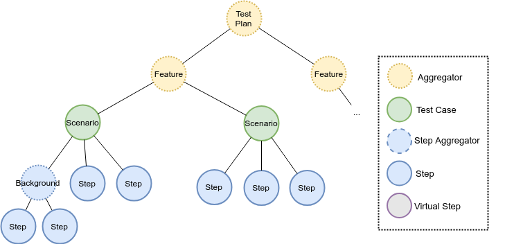

# Kukumo::CORE

## Overview

## Test Plan

The test plan is the main piece of an execution. It is build according a set of test definition sources,
(e.g. Gherkin files) and a configuration (e.i. a set of valued properties). From a topological view, 
a test plan is just a tree of nodes of different categories:

| Node type       | Description                                                   | Children node types                 | Rearrange | Walk order |
|-----------------|---------------------------------------------------------------|-------------------------------------|-----------|------------|
| Aggregator      | Node that aggregates other nodes                              | Aggregator, Test Case               | yes       | free       |
| Test Case       | Node representing an atomic test case                         | Step Agregator, Step, Virtual Step  | no        | strict     |
| Step Aggregator | Node representing a subset of steps within a test case        | Step Aggregator, Step, Virtual Step | no        | strict     |
| Step            | Node representing an executable step wihtin a test case       | --                                  | --        | --         |
| Virtual Step    | Node representing an _non_-executable step wihtin a test case | --                                  | --        | --         |

For example, for a traditional Gherkin feature file, the built test plan would correspond 
to the following diagram:

<p align="center"></p>

The idea of representing the test plan as a tree of nodes allows to adapt the original resulting plan 
prior to execution, by applying regular graph transformations during a `plan redefinition` stage.

## Usage

The regular use of Kukumo is via one of the launchers available: the Kukumo JUnit Runner,
the Kukumo Maven plugin, and the Kukumo stand-alone launcher. This document focus on the 
first one, if you require information about any of the other two check their corresponding
documentation page.

### Kukumo JUnit runner

Kukumo provides, as a part of the core componente, a JUnit 4.x runner that can be used to execute a 
test plan built according the received configuration. In order to do this, create a regular 
Java class annotated with `@RunWith` in order to use the Kukumo runner instead of the by-default 
JUnit runner.

Also, you should provide a configuration using the annotation `@Configuration` (see the Kukumo tool 
`Configurer` for further explanation of this mechanism).   
  
```java
@Configurator(properties = {
   @Property(key="resourceTypes",value="gherkin"),
   @Property(key="resourcePath", value="src/test/resources/features"),
   @Property(key="outputFilePath", value="target/kukumo.json"),
   @Property(key="junit.treatStepsAsTests",value="false")
})
@RunWith(KukumoJUnitRunner.class)
public class KukumoTestPlan {
    
}
``` 
An alternative (or complementary) way to define the configuration is use an external file. The following
example would be equivalent to the one shown above.

###### KukumoTestPlan.java
```java
@Configurator(path = "classpath:kukumo.yaml", pathPrefix = "kukumo")
@RunWith(KukumoJUnitRunner.class)
public class KukumoTestPlan {
    
}
```
###### kukumo.yaml
```yaml
kukumo:
  resourceTypes:
    - gherkin
  resourcePath: src/test/resources/features 
  outputFilePath: target/kukumo.json
  junit:
    treatStepsAsTests: false
```

Notice that, in both cases, the test class is empty; since the test cases are discovered via the 
configuration, no code is required. In actuality, if you write methods annotated with `@Test`, `@Before` 
and `@After`, the runner will complain at execution time and abort the run in order to avoid misleading 
dead test code.

You _can_, however, annotate static methods with `@BeforeClass` and `@AfterClass`, if you require 
some code to be executed prior to or following the Kukumo execution.


#### Test case notification _vs_ step notification

The regular behaviour of the Kukumo JUnit runner is notify to JUnit each test case result but not 
individual step results. It means that, for example, if your testing inside an IDE with JUnit integration, 
the graphical view will not mark an specific step has failed but the whole test case.

In order to provide more descriptive info, you can force Kukumo to notify each step as a test case, 
so they will be shown in the graphical tools and reports. One drawback is that the number of tests 
would be no longer accurate since it will represent the total number of steps instead of the real 
number of test cases. Thus, you may use this option as a debugging feature when a test case has failed, 
but keep it disabled for normal executions.  


#### Configuration
| Key | Accepted values | Default value | Comments
|---|---|---|---
|`junit.treatStepsAsTests`|`true`,`false`|`false`| When enabled, any step will be notified to JUnit as an individual test case 

---

### Maven dependency

```xml
<dependency>
    <groupId>iti.kukumo</groupId>
    <artifactId>kukumo-core</artifactId>
    <version>1.1.0</version>
</dependency>
```

  
### Launchin Kukumo programatically

## Plugin development