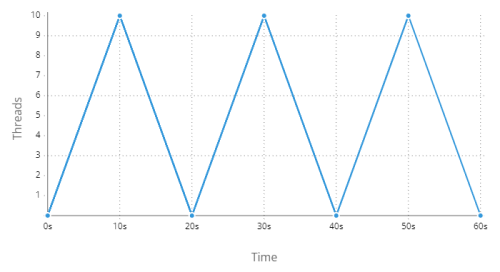
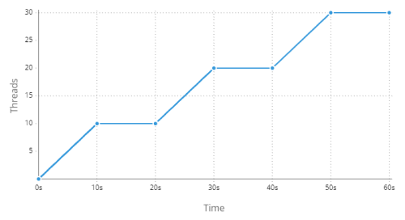
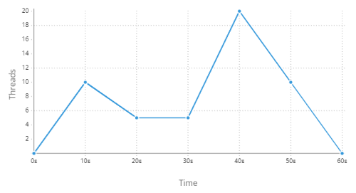

This plugin provides a set of steps for conducting performance testing using JMeter DSL.


## Install

Include the module in the corresponding section.

```text tabs=coord name=yaml copy=true
es.iti.wakamiti:jmeter-wakamiti-plugin:1.0.0
```

```text tabs=coord name=maven copy=true
<dependency>
  <groupId>es.iti.wakamiti</groupId>
  <artifactId>jmeter-wakamiti-plugin</artifactId>
  <version>1.0.0</version>
</dependency>
```


## Options

### `jmeter.baseURL`
- Type: `URL` *required*

Defines the base URL for REST calls. This setting is equivalent to the [Define base URL](#define-base-url) step if a
more descriptive statement is preferred.

Example:
```yaml
jmeter:
  baseURL: https://example.org/api/v2
```

### `jmeter.contentType`
- Type: `string`
- Default: `APPLICATION_JSON`

Specifies the type of content to send in the header of REST calls. Accepted values are:

| literal                       | `content-type` header value         |
|-------------------------------|-------------------------------------|
| `WILDCARD`                    | `*/*`                               |
| `TEXT_PLAIN`                  | `text/plain`                        |
| `TEXT_XML`                    | `text/xml`                          |
| `TEXT_HTML`                   | `text/html`                         |
| `APPLICATION_JSON`            | `application/json`                  |
| `APPLICATION_XML`             | `application/xml`                   |
| `APPLICATION_XHTML_XML`       | `application/xhtml+xml`             |
| `APPLICATION_SVG_XML`         | `application/svg+xml`               |
| `APPLICATION_SOAP_XML`        | `application/soap+xml`              |
| `APPLICATION_ATOM_XML`        | `application/atom+xml`              |
| `APPLICATION_FORM_URLENCODED` | `application/x-www-form-urlencoded` |
| `APPLICATION_OCTET_STREAM`    | `application/octet-stream`          |
| `MULTIPART_FORM_DATA`         | `multipart/form-data`               |

Example:
```yaml
jmeter:
  contentType: APPLICATION_XML
```


### `jmeter.httpCodeThreshold`
- Type: `integer`
- Default: `500`

Sets a limit on HTTP response codes. Whenever a REST call returns an HTTP code equal to or greater than this value, the
step is automatically marked as failed without checking any other conditions.

Example:
```yaml
jmeter:
  httpCodeThreshold: 999
```


### `jmeter.timeout`
- Type: `integer`
- Default: `60000`

Sets a maximum response time (in milliseconds) for subsequent HTTP requests. If this time is exceeded, the request is
aborted and an error is raised.

Example:
```yaml
jmeter:
  timeout: 10000
```


### `jmeter.cookies`
- Type: `boolean`
- Default: `false`


### `jmeter.cache`
- Type: `boolean`
- Default: `false`


### `jmeter.resources.download`
- Type: `boolean`
- Default: `false`


### `jmeter.resources.regex`
- Type: `regex`


### `jmeter.csv.delimiter`
- Type: `string`
- Default: `,`


### `jmeter.csv.encoding`
- Type: `charset`
- Default: `UTF-8`


### `jmeter.csv.eofStop`
- Type: `boolean`
- Default: `false`


### `jmeter.csv.random`
- Type: `boolean`
- Default: `false`


### `jmeter.csv.sharing`
- Type: `string`
- Default: `ALL_THREADS`


Accepted values are:

| Name         | Description                                                                                                                                                                                                                                                           |
|--------------|-----------------------------------------------------------------------------------------------------------------------------------------------------------------------------------------------------------------------------------------------------------------------|
| ALL_THREADS  | All threads in the test plan will share the CSV file, meaning that any thread iteration will consume an entry from it. You can think as having only one pointer to the current line of the CSV, being advanced by any thread iteration. The file is only opened once. |
| THREAD_GROUP | CSV file consumption is only shared within thread groups. This means that threads in separate thread groups will use separate indexes to consume the data. The file is open once per thread group.                                                                    |
| THREAD       | CSV file consumption is isolated per thread. This means that each thread will start consuming the CSV from the beginning and not share any information with other threads. The file is open once per thread.                                                          |


### `jmeter.proxy.url`
- Type: `url`


### `jmeter.proxy.username`
- Type: `string`


### `jmeter.proxy.password`
- Type: `string`


### `jmeter.oauth2.url`
- Type: `URL`

Specifies the [OAuth 2.0][oauth2] authentication service to use to generate the token to be sent in the `Authorization`
HTTP header of REST calls.

Example:
```yaml
jmeter:
  oauth2: 
    url: https://accounts.google.com/o/oauth2/auth
```


### `jmeter.oauth2.clientId`
- Type: `string`

Sets the `clientId` parameter for the [OAuth 2.0][oauth2] authentication service defined by the value of the
`jmeter.oauth2.url` configuration property.

Example:
```yaml
jmeter:
  oauth2: 
    clientId: WEB_APP
```


### `jmeter.oauth2.clientSecret`
- Type: `string`

Sets the `clientSecret` parameter for the [OAuth 2.0][oauth2] authentication service defined by the value of the
`jmeter.oauth2.url` configuration property.

Example:
```yaml
jmeter:
  oauth2: 
    clientSecret: ABRACADABRAus1ZMGHvq9R
```


### `jmeter.oauth2.cached`
- Type: `boolean`
- Default: `false`

Specifies whether to cache the retrieved token to avoid repeated calls to the oauth service for the same data.

Example:
```yaml
jmeter:
  oauth2:
    cached: true
```


### `jmeter.oauth2.parameters`
- Type: `property[]`

Sets the default parameters for OAuth authentication.

Example:
```yaml
jmeter:
  oauth2:
    parameters:
      grant_type: password
      username: pepe
      password: 1234asdf
      scope: something
```


### `jmeter.redirect.follow`
- Type: `boolean`
- Default: `true`

Specifies whether to allow redirects in HTTP calls.

Example:
```yaml
jmeter:
  redirect:
    follow: false
```


### `jmeter.report.tree`
- Type: `boolean`
- Default: `false`


### `jmeter.report.jtl`
- Type: `path`
- Default: `./wakamiti.jtl`


### `jmeter.report.html`
- Type: `path`


### `jmeter.report.influx.url`
- Type: `url`


### `jmeter.report.influx.token`
- Type: `string`


### `jmeter.report.influx.title`
- Type: `string`


### `jmeter.report.influx.application`
- Type: `string`


### `jmeter.report.influx.measurement`
- Type: `string`


### `jmeter.report.influx.samplersRegex`
- Type: `regex`


### `jmeter.report.influx.tags`
- Type: `property[]`


### `jmeter.report.influx.percentiles`
- Type: `long[]`


### `jmeter.report.graphite.url`
- Type: `url`


### `jmeter.report.influx.prefix`
- Type: `string`


## Steps


### Define base URL
```text copy=true
the base URL {url}
```
Declarative-way for setting the configuration property [`jmeter.baseURL`](#jmeterbaseurl).

#### Parameters:
| Name  | Wakamiti type    | Description |
|-------|------------------|-------------|
| `url` | `url` *required* | Base URL    |

#### Examples:
```gherkin
Given the base URL https://example.org/api
```


### Define content type
```text copy=true
{word} as content type
```
Declarative-way for setting the configuration property [`jmeter.contentType`](#jmetercontenttype).

#### Parameters:
| Name   | Wakamiti type     | Description      |
|--------|-------------------|------------------|
| `type` | `word` *required* | the content type |

#### Examples:
```gherkin
Given APPLICATION_XML as content type
```


### Define timeout
```text copy=true
a timeout of {duration}
```
Sets a response timeout for the subsequent HTTP requests.

#### Parameters:
| Name       | Wakamiti type              | Description |
|------------|----------------------------|-------------|
| `duration` | [`duration`][3] *required* | The timeout |

#### Examples:
```gherkin
Given a timeout of 12000 milliseconds
```
```gherkin
Given a timeout of 2 seconds
```


### Define HTTP code threshold
```text copy=true
(that) any request will be successful if its HTTP code {matcher}
```
Sets the range of http codes that are valid for all http requests.
It's similar to setting the configuration property [`jmeter.httpCodeTreshold`](#jmeterhttpcodethreshold) but using any 
integer assertion.

#### Parameters:
| Name      | Wakamiti type                  | Description             |
|-----------|--------------------------------|-------------------------|
| `matcher` | `integer-assertion` *required* | Numeric [comparator][2] |

#### Example:
```gherkin
* any request will be successful if its HTTP code is greater than 500
```


### Define cookies
```text copy=true
(that) cookies are (enabled|disabled)
```
Enables or disables cookies for all http requests.

#### Example:
```gherkin
Given that cookies are enabled
```


### Define cache
```text copy=true
(that) cache is (enabled|disabled)
```
Enables or disables cache for all http requests.

#### Example:
```gherkin
Given that cache is enabled
```


### Define embedded resources download
```text copy=true
(that) embedded resources will (not) be downloaded
```
Enables or disables download of embedded resources on all http requests.

#### Example:
```gherkin
Given that embedded resources will be downloaded
```


### Define embedded resources download pattern
```text copy=true
(that) embedded resources (matching|do not match) the {pattern} pattern are downloaded
```
Specifies the regular expression of the embedded resources to download or not on all http requests.

#### Parameters:
| Name      | Wakamiti type      | Description                |
|-----------|--------------------|----------------------------|
| `pattern` | `regex` *required* | A valid regular expression |

#### Example:
```gherkin
Given that embedded resources matching the '.*' pattern are downloaded
```
```gherkin
Given that embedded resources do not match the '.*' pattern are downloaded
```


### Define proxy
```text copy=true
a proxy with the URL {url} (and credentials {username}:{password})
```
Specifies the URL, with or without credentials, of a proxy server through which HTTP requests are sent to their final 
destination.

#### Parameters:
| Name       | Wakamiti type    | Description        |
|------------|------------------|--------------------|
| `url`      | `url` *required* | The proxy url      |
| `username` | `text`           | The proxy username |
| `password` | `text`           | The proxy password |

#### Example:
```gherkin
Given a proxy with the URL https://proxy.org
```
```gherkin
Given a proxy with the URL https://proxy.org and credentials 'user1':'s3cr3t'
```


### Define basic authentication
```text copy=true
the service uses the basic authentication credentials {username}:{password}
```
Sets the basic authentication credentials to be sent in the `Authorization` header for the subsequent requests.

#### Parameters:
| Name       | Wakamiti type     | Description  |
|------------|-------------------|--------------|
| `username` | `text` *required* | The username |
| `password` | `text` *required* | The password |

#### Examples:
```gherkin
Given the service uses the basic authentication credentials 'us1532':'xxxxx'
```


### Define oauth2 authentication
```text copy=true
the service uses the oauth authentication
```
Sets the bearer authentication token to be sent in the `Authorization` header, which is previously retrieved from the
configured oauth2 service ([url](#jmeteroauth2url), [clientId](#jmeteroauth2clientid),
[clientSecret](#jmeteroauth2clientsecret), [parameters](#jmeteroauth2parameters)), for the following requests.


#### Examples:
```gherkin
Given the service uses the oauth authentication
```


### Define oauth2 authentication by token
```text copy=true
the service uses the oauth authentication token {token}
```
Sets the bearer authentication token to be sent in the `Authorization` header for subsequent requests.

#### Parameters:
| Name    | Wakamiti type     | Description          |
|---------|-------------------|----------------------|
| `token` | `text` *required* | Authentication token |

#### Examples:
```gherkin
Given the service uses the oauth authentication token 'hudytw9834y9cqy32t94'
```


### Define oauth2 authentication by token (file)
```text copy=true
the service uses the oauth authentication token from the file {file}
```
Sets the bearer authentication token to be sent in the `Authorization` header for subsequent requests, from file.

#### Parameters:
| Name   | Wakamiti type     | Description                        |
|--------|-------------------|------------------------------------|
| `file` | `file` *required* | File with the authentication token |

#### Examples:
```gherkin
Given the service uses the oauth authentication token from the file 'token.txt'
```


### Define oauth2 authentication by credentials
```text copy=true
the service uses the oauth authentication credentials {username}:{password}
```
```text copy=true
the service uses the oauth authentication credentials {username}:{password} with the following parameters:
    {table}
```
Sets the bearer authentication token to be sent in the `Authorization` header, which is previously retrieved from the
configured oauth2 service ([url](#jmeteroauth2url), [clientId](#jmeteroauth2clientid), 
[clientSecret](#jmeteroauth2clientsecret)), using the indicated credentials, for the following requests.

Additional parameters supported by `Oauth` can also be added using a table.

#### Parameters:
| Name       | Wakamiti type     | Description                             |
|------------|-------------------|-----------------------------------------|
| `username` | `text` *required* | The username                            |
| `password` | `text` *required* | The password                            |
| `table`    | `table`           | A table with `name` and `value` columns |

#### Examples:
```gherkin
Given the service uses the oauth authentication credentials 'us1532':'xxxxx'
```
```gherkin
Given the service uses the oauth authentication credentials 'us1532':'xxxxx' with the following parameters:
  | name  | value     |
  | scope | something |
```


### Define oauth2 authentication by client
```text copy=true
the service uses the oauth authentication
```
```text copy=true
the service uses the oauth authentication with the following parameters:
    {table}
```
Sets the bearer authentication token to be sent in the `Authorization` header, which is previously retrieved from the
configured oauth2 service ([url](#jmeteroauth2url), [clientId](#jmeteroauth2clientid), 
[clientSecret](#jmeteroauth2clientsecret)), using client data, for the following requests.

Additional parameters supported by `Oauth` can also be added using a table.

#### Parameters:
| Name    | Wakamiti type | Description                             |
|---------|---------------|-----------------------------------------|
| `table` | `table`       | A table with `name` and `value` columns |

#### Examples:
```gherkin
Given the service uses the oauth authentication
```
```gherkin
Given the service uses the oauth authentication with the following parameters:
  | name  | value     |
  | scope | something |
```


### Clear authentication
```text copy=true
the service does not use authentication
```
Deletes the authentication header.

##### Examples:
```gherkin
Given the service does not use authentication
```


### Define dataset
```text copy=true
the data in file {file}
```
Sets the dataset from a CSV file for HTTP requests.

By default, the CSV file will be opened once and shared by all threads. This means that when one thread reads a CSV 
line in one iteration, then the following thread reading a line will continue with the following line.

If you want to change this (to share the file per thread group or use one file per thread), then you can use the 
[`jmeter.csv.sharing`](#jmetercsvsharing) property. 

Check [`csv`](#jmetercsvdelimiter) properties for additional details and options (like changing delimiter, stopping on 
the end of file, etc.).

#### Parameters:
| Name   | Wakamiti type     | Description |
|--------|-------------------|-------------|
| `file` | `file` *required* | A csv file  |

#### Examples:
```gherkin
Given the data in file 'data/users.csv'
```


### Define variables
```text copy=true
variable {name} with value {value}
```
Sets a single variable for HTTP requests.

#### Parameters:
| Name    | Wakamiti type     | Description   |
|---------|-------------------|---------------|
| `name`  | `text` *required* | The var name  |
| `value` | `text` *required* | The var value |

#### Examples:
```gherkin
Given variable 'something' with value 'abc'
And a GET call to the service '/users/{something}'
```


### Define variables (table)
```text copy=true
the following variables:
    {table}
```
Sets multiple variables for HTTP requests.

#### Parameters:
| Name    | Wakamiti type      | Description                             |
|---------|--------------------|-----------------------------------------|
| `table` | `table` *required* | A table with `name` and `value` columns |

#### Examples:
```gherkin
Given the following variables:
  | Name | Value    |
  | id   | 13       |
  | city | Valencia |
And a GET call to the service '/users/{id}?city={city}'
```


### Define request
```text copy=true
a {method} call to the service {service}
```
Defines a HTTP request to a service. The remaining parts of the call are defined in subsequent steps until another REST 
call is defined.

Multiple calls can be defined in a scenario.

#### Parameters:
| Name      | Wakamiti type     | Description                               |
|-----------|-------------------|-------------------------------------------|
| `method`  | `word` *required* | The call method (`GET`, `PUT`, `POST`...) |
| `service` | `text` *required* | The service url                           |

#### Examples:
```gherkin
Given a GET call to the service '/users'
```


### Define request body
```text copy=true
with the following data:
    {data}
```
Defines the payload body of the current HTTP request. 

#### Parameters:
| Name   | Wakamiti type         | Description              |
|--------|-----------------------|--------------------------|
| `data` | `document` *required* | The request payload body |

#### Examples:
```gherkin
Given a POST call to the service '/users'
* with the following data:
  """json
  {
    "firstName": "John",
    "lastName": "Doe",
    "birthDate": "1980-02-20",
    "address": "221B, Baker Street"
  }
  """
```


### Define request body (file)
```text copy=true
with the data from the file {file}
```
Defines the payload body of the current HTTP request. The payload is provided by the given file.

#### Parameters:
| Name   | Wakamiti type     | Description                                |
|--------|-------------------|--------------------------------------------|
| `file` | `file` *required* | A file containing the request payload body |

#### Examples:
```gherkin
Given a POST call to the service '/users'
* with the data from the file 'data/user123.json'
```


### Define request parameters or headers
```text copy=true
with the (parameter|header|form parameter) {name} with value {value}
```
Defines a header, parameter or form parameter of the current HTTP request. 

#### Parameters:
| Name    | Wakamiti type     | Description         |
|---------|-------------------|---------------------|
| `name`  | `text` *required* | The parameter name  |
| `value` | `text` *required* | The parameter value |

#### Examples:
```gherkin
Given a GET call to the service '/users'
* with the parameter 'id' with value '13'
```
```gherkin
Given a GET call to the service '/users'
* with the form parameter 'id' with value '13'
```
```gherkin
Given a GET call to the service '/users'
* with the header 'Keep-Alive' with value '1200'
```


### Define request parameters (table)
```text copy=true
with the following (parameters|headers|form parameters):
    {table}
```
Defines multiple headers, parameters or form parameters of the current HTTP request.

#### Parameters:
| Name    | Wakamiti type      | Description                             |
|---------|--------------------|-----------------------------------------|
| `table` | `table` *required* | A table with `name` and `value` columns |

#### Examples:
```gherkin
Given a GET call to the service '/users'
* with the following parameters:
  | Name | Value    |
  | id   | 13       |
  | city | Valencia |
```
```gherkin
Given a GET call to the service '/users'
* with the following form parameters:
  | Name | Value    |
  | id   | 13       |
  | city | Valencia |
```
```gherkin
Given a GET call to the service '/users'
* with the following headers:
  | Name       | Value    |
  | Age        | 3600     |
  | Keep-Alive | 1200     |
```


### Define request attached file 
```text copy=true
with the attached file {file} named {name}
```
Defines a file attachment in the current request.

#### Parameters:
| Name   | Wakamiti type     | Description       |
|--------|-------------------|-------------------|
| `file` | `file` *required* | File to be attach |

#### Examples:
```gherkin
Given a POST call to the service '/users'
* with the attached file 'data/data.txt' named 'file'
```


### Define request extractor
```text copy=true
with the regular expression {regex} extracted in the variable {name}
```
```text copy=true
with json value {query} extracted in the variable {name}
```
```text copy=true
with the fragment between {leftBoundary} and {rightBoundary} extracted in the variable {name}
```
Defines a data extractor of the current request response. This extractor can be from a regular expression, a json path 
or defined boundaries.

#### Parameters:
| Name            | Wakamiti type      | Description                        |
|-----------------|--------------------|------------------------------------|
| `regex`         | `text`             | The regular expression             |
| `query`         | `text`             | The json path                      |
| `leftBoundary`  | `text`             | The left boundary                  |
| `rightBoundary` | `text`             | The right boundary                 |
| `name`          | `text` *required*  | The name of the variable extracted |


#### Examples:
```gherkin
Given a GET call to the service '/users'
* with the regular expression '"id":\s*"([^"]+)"' extracted in the variable 'id'
And a GET call to the service '/users/{id}'
```
```gherkin
Given a GET call to the service '/users'
* with json value '[0].id' extracted in the variable 'id'
And a GET call to the service '/users/{id}'
```
```gherkin
Given a GET call to the service '/users'
* with the fragment between '"id":"' and '"' extracted in the variable 'id'
And a GET call to the service '/users/{id}'
```


### Execute simple
```text copy=true
{threads} thread(s) (is|are) executed
```
Executes a thread group the specified number of times.

#### Parameters:
| Name      | Wakamiti type    | Description               |
|-----------|------------------|---------------------------|
| `threads` | `int` *required* | Number of times to launch |

#### Examples:
```gherkin
Given a GET call to the service '/users'
When 1 thread is executed
```


### Execute load
```text copy=true
{threads} thread(s) (is|are) executed in {ramp} holding {hold}
```
Executes a thread group for the specified number of threads, ramp-up time and hold time.

#### Parameters:
| Name      | Wakamiti type              | Description               |
|-----------|----------------------------|---------------------------|
| `threads` | `int` *required*           | Number of times to launch |
| `ramp`    | [`duration`][3] *required* |                           |
| `hold`    | [`duration`][3] *required* |                           |

#### Examples:
```gherkin
Given a GET call to the service '/users'
When 10 threads are executed in 10 seconds holding 30 seconds
```

This produces the following scenario:


### Execute load (iterations)
```text copy=true
{threads} thread(s) (is|are) executed in {ramp} {iterations} time(s)
```
Executes a thread group for the specified number of threads, ramp-up, for the specified number of times.

#### Parameters:
| Name         | Wakamiti type              | Description               |
|--------------|----------------------------|---------------------------|
| `threads`    | `int` *required*           | Number of times to launch |
| `ramp`       | [`duration`][3] *required* |                           |
| `iterations` | `int` *required*           |                           |

#### Examples:
```gherkin
Given a GET call to the service '/users'
When 10 threads are executed in 10 seconds 3 times
```

This produces the following scenario:




### Execute load (increase)
```text copy=true
{threads} thread(s) (is|are) executed in {ramp} every {hold} {iterations} time(s)
```
Executes a thread group for the specified number of threads, ramping up, increasing threads every specified time for a 
specified number of times.

#### Parameters:
| Name         | Wakamiti type              | Description               |
|--------------|----------------------------|---------------------------|
| `threads`    | `int` *required*           | Number of times to launch |
| `ramp`       | [`duration`][3] *required* |                           |
| `hold`       | [`duration`][3] *required* |                           |
| `iterations` | `int` *required*           |                           |

#### Examples:
```gherkin
Given a GET call to the service '/users'
When 10 threads are executed in 10 seconds every 10 seconds 3 times
```

This produces the following scenario:




### Execute load (stretches)
```text copy=true
a test is executed with the following stretches:
  {table}
```
Executes a thread group for the specified stretches, including:
1. the number of threads
2. The ramp duration
3. The hold duration

#### Parameters:
| Name    | Wakamiti type      | Description |
|---------|--------------------|-------------|
| `table` | `table` *required* | Stretches   |

#### Examples:
```gherkin
Given a GET call to the service '/users'
When a test is executed with the following stretches:
  | threads | ramp       | hold       |
  | 10      | 10 seconds | 0 seconds  |
  | 5       | 10 seconds | 10 seconds |
  | 20      | 10 seconds | 0 seconds  |
  | 0       | 20 seconds | 0 seconds  | 
```

This produces the following scenario:




### Check metric
```text copy=true
the {metric} {matcher}
```
Validates that a result metric matches the specified matcher.

#### Parameters:
| Name      | Wakamiti type            | Description            |
|-----------|--------------------------|------------------------|
| `metric`  | `*-metric` *required*    | The result [metric][1] |
| `matcher` | `*-assertion` *required* | [Comparator][2]        |
`*`: [`duration`][3], `long` o `double`.

#### Examples:
```gherkin
Then the 99th percentile is less than 3 seconds
```
```gherkin
Then the number of errors is less than 10
```
```gherkin
Then the number of samples per second is greater than 5.5
```


## Data types

### `duration-metric`

Accepted values are:
- `minimum duration`
- `maximum duration`
- `average duration`
- `median`
- `90th percentile`
- `95th percentile`
- `99th percentile`


### `long-metric`

Accepted values are:
- `number of samples`
- `number of errors`
- `number of bytes received`
- `number of bytes sent`


### `double-metric`

Accepted values are:
- `number of samples per second`
- `number of errors per second`
- `number of bytes received per second`
- `number of bytes sent per second`


[oauth2]: https://datatracker.ietf.org/doc/html/rfc6749 (OAuth 2.0)
[1]: #data-types
[2]: en/wakamiti/architecture#comparators
[3]: en/wakamiti/architecture#duration