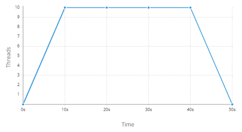
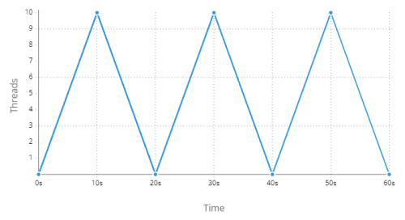
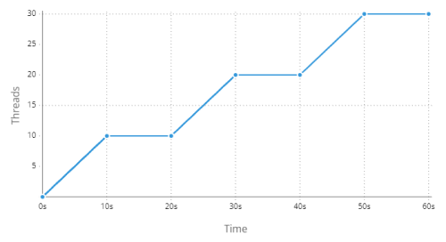
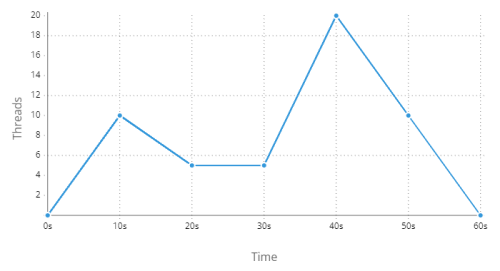

Este plugin proporciona un conjunto de pasos para realizar pruebas de rendimiento utilizando JMeter DSL.


## Instalación

Incluye el módulo en la sección correspondiente.

```text tabs=coord name=yaml copy=true
es.iti.wakamiti:jmeter-wakamiti-plugin:1.0.0
```

```text tabs=coord name=maven copy=true
<dependency>
  <groupId>es.iti.wakamiti</groupId>
  <artifactId>jmeter-wakamiti-plugin</artifactId>
  <version>1.0.0</version>
</dependency>
```


## Configuración

### `jmeter.baseURL`
- Tipo: `URL` *requerido*

Establece la URL base para las llamadas REST. Esta configuración es equivalente al paso 
[Definir URL base](#definir-url-base) si se prefiere una declaración más descriptiva.

Ejemplo:
```yaml
jmeter:
  baseURL: https://example.org/api/v2
```


### `jmeter.contentType`
- Tipo: `string`
- Por defecto: `APPLICATION_JSON`

Establece el tipo de contenido que se enviará en la cabecera de las llamadas REST.
Los valores aceptados son:

| literal                       | valor de la cabecera `content-type` |
|-------------------------------|-------------------------------------|
| `WILDCARD`                    | `*/*`                               |
| `TEXT_PLAIN`                  | `text/plain`                        |
| `TEXT_XML`                    | `text/xml`                          |
| `TEXT_HTML`                   | `text/html`                         |
| `APPLICATION_JSON`            | `application/json`                  |
| `APPLICATION_XML`             | `application/xml`                   |
| `APPLICATION_XHTML_XML`       | `application/xhtml+xml`             |
| `APPLICATION_SVG_XML`         | `application/svg+xml`               |
| `APPLICATION_SOAP_XML`        | `application/soap+xml`              |
| `APPLICATION_ATOM_XML`        | `application/atom+xml`              |
| `APPLICATION_FORM_URLENCODED` | `application/x-www-form-urlencoded` |
| `APPLICATION_OCTET_STREAM`    | `application/octet-stream`          |
| `MULTIPART_FORM_DATA`         | `multipart/form-data`               |

Ejemplo:
```yaml
jmeter:
  contentType: APPLICATION_XML
```


### `jmeter.httpCodeThreshold`
- Tipo: `integer`
- Por defecto: `500`

Establece un límite a los códigos de respuesta HTTP. Cada vez que una llamada REST retorne un código HTTP igual o
superior a este valor, el paso se marcará como fallido automáticamente, sin comprobar ninguna otra condición.

Example:
```yaml
jmeter:
  httpCodeThreshold: 999
```


### `jmeter.timeout`
- Tipo: `integer`
- Por defecto: `60000`

Establece un tiempo máximo de respuesta (en milisegundos) para las siguientes peticiones HTTP. En el caso de exceder el
tiempo indicado se detendrá la llamada y se producirá un error.

Ejemplo:
```yaml
jmeter:
  timeout: 10000
```


### `jmeter.cookies`
- Tipo: `boolean`
- Por defecto: `false`


### `jmeter.cache`
- Tipo: `boolean`
- Por defecto: `false`


### `jmeter.resources.download`
- Tipo: `boolean`
- Por defecto: `false`


### `jmeter.resources.regex`
- Tipo: `regex`


### `jmeter.csv.delimiter`
- Tipo: `string`
- Por defecto: `,`


### `jmeter.csv.encoding`
- Tipo: `charset`
- Por defecto: `UTF-8`


### `jmeter.csv.eofStop`
- Tipo: `boolean`
- Por defecto: `false`


### `jmeter.csv.random`
- Tipo: `boolean`
- Por defecto: `false`


### `jmeter.csv.sharing`
- Tipo: `string`
- Por defecto: `ALL_THREADS`


Los valores aceptados son:

| Name         | Description                                                                                                                                                                                                                                                                                                 |
|--------------|-------------------------------------------------------------------------------------------------------------------------------------------------------------------------------------------------------------------------------------------------------------------------------------------------------------|
| ALL_THREADS  | Todos los hilos del plan de pruebas compartirán el archivo CSV, lo que significa que cualquier iteración del hilo consumirá una entrada del mismo. Se puede pensar como tener sólo un puntero a la línea actual del CSV, siendo avanzado por cualquier iteración del hilo. El archivo sólo se abre una vez. |
| THREAD_GROUP | El consumo de archivos CSV sólo se comparte dentro de los grupos de hilos. Esto significa que los hilos en grupos de hilos separados utilizarán índices separados para consumir los datos. El archivo se abre una vez por grupo de hilos.                                                                   |
| THREAD       | El consumo de archivos CSV está aislado por subproceso. Esto significa que cada hilo comenzará a consumir el CSV desde el principio y no compartirá ninguna información con otros hilos. El fichero se abre una vez por hilo.                                                                               |


### `jmeter.proxy.url`
- Tipo: `url`


### `jmeter.proxy.username`
- Tipo: `string`


### `jmeter.proxy.password`
- Tipo: `string`


### `jmeter.oauth2.url`
- Tipo: `URL`

Establece el servicio de autenticación [OAuth 2.0][oauth2] que se usará para generar el token que se enviará en la
cabecera HTTP `Authorization` de las llamadas REST.

Ejemplo:
```yaml
jmeter:
  oauth2: 
    url: https://accounts.google.com/o/oauth2/auth
```


### `jmeter.oauth2.clientId`
- Tipo: `string`

Establece el parámetro `clientId` para el servicio de autenticación [OAuth 2.0][oauth2] definido por el valor de la
propiedad de configuración `jmeter.oauth2.url`.

Ejemplo:
```yaml
jmeter:
  oauth2: 
    clientId: WEB_APP
```


### `jmeter.oauth2.clientSecret`
- Tipo: `string`

Establece el parámetro `clientSecret` para el servicio de autenticación [OAuth 2.0][oauth2] definido por el valor de la
propiedad de configuración `jmeter.oauth2.url`.

Ejemplo:
```yaml
jmeter:
  oauth2: 
    clientSecret: ABRACADABRAus1ZMGHvq9R
```


### `jmeter.oauth2.cached`
- Tipo: `boolean`
- Por defecto: `false`

Establece si el token recuperado se guarda en caché para evitar llamadas recurrentes al servicio oauth si los datos son
los mismos.

Ejemplo:
```yaml
jmeter:
  oauth2:
    cached: true
```


### `jmeter.oauth2.parameters`
- Tipo: `property[]`

Establece los parámetros por defecto de la autenticación oauth.

Ejemplo:
```yaml
jmeter:
  oauth2:
    parameters:
      grant_type: password
      username: pepe
      password: 1234asdf
      scope: something
```


### `jmeter.redirect.follow`
- Tipo: `boolean`
- Por defecto: `true`

Establece si se permite seguir las redirecciones en las llamadas HTTP.

Ejemplo:
```yaml
jmeter:
  redirect:
    follow: false
```


### `jmeter.report.tree`
- Tipo: `boolean`
- Por defecto: `false`


### `jmeter.report.jtl`
- Tipo: `path`
- POr defecto: `./wakamiti.jtl`


### `jmeter.report.html`
- Tipo: `path`


### `jmeter.report.influx.url`
- Tipo: `url`


### `jmeter.report.influx.token`
- Tipo: `string`


### `jmeter.report.influx.title`
- Tipo: `string`


### `jmeter.report.influx.application`
- Tipo: `string`


### `jmeter.report.influx.measurement`
- Tipo: `string`


### `jmeter.report.influx.samplersRegex`
- Tipo: `regex`


### `jmeter.report.influx.tags`
- Tipo: `property[]`


### `jmeter.report.influx.percentiles`
- Tipo: `long[]`


### `jmeter.report.graphite.url`
- Tipo: `url`


### `jmeter.report.influx.prefix`
- Tipo: `string`


## Pasos

### Definir URL base
```text copy=true
la URL base {url}
```
Establece la ruta base de la API. Este paso es equivalente a configurar la propiedad [`jmeter.baseURL`](#jmeterbaseurl).


#### Parámetros:
| Nombre | Wakamiti type       | Descripción |
|--------|---------------------|-------------|
| `url`  | `url` *obligatorio* | URL base    |

#### Ejemplos:
```gherkin
Dada la URL base https//example.org/api
```


### Definir tipo de contenido
```text copy=true
{type} como el tipo de contenido
```
Establece el tipo de contenido de la API en la cabecera `content-type`. Este paso es equivalente a configurar la
propiedad [`jmeter.contentType`](#jmetercontenttype).

#### Parámetros:
| Nombre | Wakamiti type        | Descripción        |
|--------|----------------------|--------------------|
| `type` | `word` *obligatorio* | La URL de conexión |

#### Ejemplos:
```gherkin
Dado APPLICATION_XML como el tipo de contenido
```


### Definir timeout
```text copy=true
un timeout de {duration}
```
Establece un tiempo máximo de respuesta para las siguientes peticiones HTTP. En el caso de
exceder el tiempo indicado se detendrá la llamada y se producirá un error.

#### Parámetros:
| Name       | Wakamiti type               | Description      |
|------------|-----------------------------|------------------|
| `duration` | [`duration`][3] *requerido* | El tiempo máximo |

#### Ejemplos:
```gherkin
Dado un timeout de 12000 milisegundos
```
```gherkin
Dado un timeout de 10 segundos
```


### Definir umbral de códigos HTTP
```text copy=true
(que) toda petición se considera satisfactoria si su código HTTP {matcher}
```
Establece una validación general para el código HTTP de todas las respuestas siguientes. Es similar a la propiedad de
configuración [`jmeter.httpCodeTreshold`](#jmeterhttpcodethreshold) pero con una validación de enteros personalizada.

#### Parámetros:
| Nombre    | Wakamiti type                   | Descripción              |
|-----------|---------------------------------|--------------------------|
| `matcher` | `integer-assertion` *requerido* | [Comparador][1] numérico |

#### Ejemplo:
```gherkin
* toda petición se considera satisfactoria si su código HTTP es menor que 500
```


### Definir cookies
```text copy=true
(que) las cookies están (activadas|desactivadas)
```
Activa o desactiva las cookies para todas las peticiones http.

#### Ejemplo:
```gherkin
Dado que las cookies están activadas
```


### Definir cache
```text copy=true
(que) la caché está (activada|desactivada)
```
Activa o desactiva la caché para todas las peticiones http.

#### Ejemplo:
```gherkin
Dado que la caché está activada
```


### Definir descarga de recursos integrados
```text copy=true
(que) (no) se descargan los recursos embebidos
```
Activa o desactiva la descarga de recursos embebidos para todas las peticiones http.

#### Ejemplo:
```gherkin
Dado que se descargan los recursos embebidos
```


### Definir patrón de descarga de recursos integrados
```text copy=true
(que) se descargan los recursos embebidos que (no) cumplen el patrón {pattern}
```
Especifica la expresión regular de los recursos incrustados a descargar, o no, en todas las peticiones http.

#### Parámetros:
| Nombre    | Wakamiti type       | Descripción           |
|-----------|---------------------|-----------------------|
| `pattern` | `regex` *requerido* | Una expresión regular |

#### Ejemplos:
```gherkin
Dado que se descargan los recursos embebidos que cumplen el patrón '.*'
```
```gherkin
Dado que se descargan los recursos embebidos que no cumplen el patrón '.*'
```


### Definir proxy
```text copy=true
un proxy con la URL {url} (y las credenciales {username}:{password})
```
Especifica la URL, con o sin credenciales, de un servidor proxy a través del cual se envían las peticiones HTTP a su 
destino final.

#### Parámetros:
| Nombre     | Wakamiti type     | Descripción          |
|------------|-------------------|----------------------|
| `url`      | `url` *requerido* | La url del proxy     |
| `username` | `text`            | El nombre de usuario |
| `password` | `text`            | La contraseña        |

#### Ejemplos:
```gherkin
Dado un proxy con la URL https://proxy.org
```
```gherkin
Dado un proxy con la URL https://proxy.org Y las credenciales 'user1':'s3cr3t'
```


### Definir autenticación básica
```text copy=true
(que) el servicio usa autenticación básica con las credenciales {username}:{password}
```
Establece las credenciales de autenticación básica que se enviarán en la cabecera HTTP `Authorization`.


#### Parámetros:
| Nombre     | Wakamiti type      | Descripción       |
|------------|--------------------|-------------------|
| `username` | `text` *requerido* | Nombre de usuario |
| `password` | `text` *requerido* | Contraseña        |

#### Ejemplos:
```gherkin
Dado que el servicio usa autenticación básica con las credenciales 'us1532':'xxxxx'
```


### Definir autenticación oauth2
```text copy=true
(que) el servicio usa autenticación oauth
```
Establece el token de autenticación "bearer" que se enviará en la cabecera `Authorization`, que se recupera previamente
del servicio oauth2 configurado ([url](#jmeteroauth2url), [clientId](#jmeteroauth2clientid),
[clientSecret](#jmeteroauth2clientsecret), [parámetros](#jmeteroauth2parameters)), para las siguientes peticiones.

#### Ejemplos:
```gherkin
Dado que el servicio usa autenticación oauth
```


### Definir autenticación oauth2 por token
```text copy=true
(que) el servicio usa autenticación oauth con el token {token}
```
Establece el token de autenticación "bearer" que se enviará en la cabecera `Authorization` para las siguientes
peticiones.

#### Parámetros:
| Nombre  | Wakamiti type      | Descripción            |
|---------|--------------------|------------------------|
| `token` | `text` *requerido* | token de autenticación |

#### Ejemplos:
```gherkin
Dado que el servicio usa autenticación oauth con el token 'hudytw9834y9cqy32t94'
```


### Definir autenticación oauth2 por token (fichero)
```text copy=true
(que) el servicio usa autenticación oauth con el token del fichero {file}
```
Establece el token de autenticación "bearer" que se enviará en la cabecera `Authorization` para las siguientes llamadas,
obtenido desde un fichero.

#### Parámetros:
| Nombre | Wakamiti type      | Descripción                           |
|--------|--------------------|---------------------------------------|
| `file` | `file` *requerido* | Fichero con el token de autenticación |

#### Ejemplo:
```gherkin
Dado que el servicio usa autenticación oauth con el token del fichero 'token.txt'
```


### Definir autenticación oauth2 por credenciales
```text copy=true
(que) el servicio usa autenticación oauth con las credenciales {username}:{password}
```
```text copy=true
(que) el servicio usa autenticación oauth con las credenciales {username}:{password} y los siguientes parámetros:
    {table}
```
Establece el token de autenticación "bearer" que se enviará en la cabecera `Authorization`, que se recupera previamente
del servicio oauth2 configurado ([url](#jmeteroauth2url), [clientId](#jmeteroauth2clientid),
[clientSecret](#jmeteroauth2clientsecret)), usando las credenciales indicadas, para las siguientes peticiones.

También se pueden añadir más parámetros adicionales admitidos por `Oauth` mediante una tabla.

#### Parámetros:
| Nombre     | Wakamiti type      | Descripción                                   |
|------------|--------------------|-----------------------------------------------|
| `username` | `text` *requerido* | Nombre de usuario                             |
| `password` | `text` *requerido* | Contraseña                                    |
| `table`    | `table`            | Una tabla con las columnas `nombre` y `valor` |

##### Ejemplos:
```gherkin
Dado que el servicio usa autenticación oauth con las credenciales 'us1532':'xxxxx'
```

```gherkin
Dado que el servicio usa autenticación oauth con las credenciales 'us1532':'xxxxx' y los siguientes parámetros:
  | name  | value     |
  | scope | something |
```


### Definir autenticación oauth2 por cliente
```text copy=true
(que) el servicio usa autenticación oauth
```
```text copy=true
(que) el servicio usa autenticación oauth con los siguientes parámetros:
    {table}
```
Establece el token de autenticación "bearer" que se enviará en la cabecera `Authorization`, que se recupera previamente
del servicio oauth2 configurado ([url](#jmeteroauth2url), [clientId](#jmeteroauth2clientid),
[clientSecret](#jmeteroauth2clientsecret)), usando los datos del cliente, para las siguientes peticiones.

También se pueden añadir más parámetros adicionales admitidos por `Oauth` mediante una tabla.

#### Parámetros:
| Nombre  | Wakamiti type | Descripción                                   |
|---------|---------------|-----------------------------------------------|
| `table` | `table`       | Una tabla con las columnas `nombre` y `valor` |


#### Ejemplos:
```gherkin
Dado que el servicio usa autenticación oauth
```

```gherkin
Dado que el servicio usa autenticación oauth con los siguientes parámetros:
  | name  | value     |
  | scope | something |
```


### Limpiar autenticación
```text copy=true
(que) el servicio no usa autenticación
```
Elimina la cabecera con la autenticación.

#### Ejemplos:
```gherkin
Dado que el servicio no usa autenticación
```


### Definir dataset
```text copy=true
los datos del fichero {file}
```
Establece el conjunto de datos de un archivo CSV para las peticiones HTTP.

Por defecto, el archivo CSV se abrirá una vez y será compartido por todos los subprocesos. Esto significa que cuando un 
hilo lea una línea CSV en una iteración, el siguiente hilo que lea una línea continuará con la siguiente línea.

Si desea cambiar esto (para compartir el archivo por grupo de hilos o utilizar un archivo por hilo), puede utilizar la 
propiedad [`jmeter.csv.sharing`](#jmetercsvsharing).

Compruebe las propiedades [`csv`](#jmetercsvdelimiter) para detalles y opciones adicionales (como cambiar el 
delimitador, parar al final del fichero, etc.).

#### Parámetros:
| Nombre  | Wakamiti type      | Descripción    |
|---------|--------------------|----------------|
| `file`  | `file` *requerido* | Un fichero CSV |

#### Ejemplos:
```gherkin
Dado los datos del fichero 'data/users.csv'
```


### Definir variables
```text copy=true
la variable {name} con el valor {value}
```
Establece una variable para las peticiones HTTP.

#### Parámetros:
| Nombre  | Wakamiti type      | Descripción            |
|---------|--------------------|------------------------|
| `name`  | `text` *requerido* | Nombre de la variable  |
| `value` | `text` *requerido* | Valor de la variable   |

#### Ejemplos:
```gherkin
Dado la variable 'something' con el valor 'abc'
Y una llamada GET al servicio '/users/{something}'
```


### Definir variables (tabla)
```text copy=true
las siguientes variables:
    {table}
```
Establece multiples variables para las peticiones HTTP.

#### Parámetros:
| Nombre  | Wakamiti type       | Descripción                                   |
|---------|---------------------|-----------------------------------------------|
| `table` | `table` *requerido* | Una tabla con las columnas `nombre` y `valor` |

#### Ejemplos:
```gherkin
Dadas las siguientes variables:
  | Nombre | Valor    |
  | id     | 13       |
  | city   | Valencia |
Y una llamada GET al servicio '/users/{id}?city={city}'
```


### Definir petición
```text copy=true
una llamada {method} al servicio {service}
```
Define una petición HTTP a un servicio. Las partes restantes de la llamada se definen en pasos posteriores hasta que se 
defina otra llamada REST.

Se pueden definir varias llamadas en un escenario.

#### Parámetros:
| Nombre    | Wakamiti type      | Descripción                                      |
|-----------|--------------------|--------------------------------------------------|
| `method`  | `word` *requerido* | El método de la llamda (`GET`, `PUT`, `POST`...) |
| `service` | `text` *requerido* | La ruta del servicio                             |

#### Ejemplos:
```gherkin
Dada una llamada GET al servicio '/users'
```


### Definir cuerpo de la petición
```text copy=true
con los siguientes datos:
    {data}
```
Define el cuerpo del mensaje de la petición en curso.

#### Parámetros:
| Nombre | Wakamiti type          | Descripción              |
|--------|------------------------|--------------------------|
| `data` | `document` *requerido* | El cuerpo de la petición |

#### Ejemplos:
```gherkin
Dado una llamda POST al servicio '/users'
* con los siguientes datos:
  """json
  {
    "firstName": "John",
    "lastName": "Doe",
    "birthDate": "1980-02-20",
    "address": "221B, Baker Street"
  }
  """
```


### Definir cuerpo de la petición (fichero)
```text copy=true
con los datos del fichero {file}
```
Define el cuerpo del mensaje de la petición en curso a partir del contenido del fichero.

#### Parámetros:
| Nombre | Wakamiti type      | Descripción                          |
|--------|--------------------|--------------------------------------|
| `file` | `file` *requerido* | Fichero con el cuerpo de la petición |

#### Ejemplos:
```gherkin
Dado una llamda POST al servicio '/users'
* con los datos del fichero 'data/user123.json'
```


### Definir perámetros o cabeceras de la petición
```text copy=true
con (el|la) (parámetro|cabecera|parámetro de formulario) {name} con el valor {value}
```
Define una cabecera, parámetro o parámetro de formulario de la petición en curso.

#### Parámetros:
| Nombre  | Wakamiti type      | Descripción                     |
|---------|--------------------|---------------------------------|
| `name`  | `text` *requerido* | Nombre del parámetro o cabecera |
| `value` | `text` *requerido* | Valor del parámetro o cabecera  |

#### Ejemplos:
```gherkin
Dado una llamda GET al servicio '/users'
* con el parámetro 'id' con el valor '13'
```
```gherkin
Dado una llamda GET al servicio '/users'
* con el parámetro de formulario 'id' con el valor '13'
```
```gherkin
Dado una llamda GET al servicio '/users'
* con la cabecera 'Keep-Alive' con el valor '1200'
```


### Definir perámetros o cabeceras de la petición (tabla)
```text copy=true
con (los|las) siguientes (parámetros|cabeceras|parámetros de formulario):
    {table}
```
Define múltiples cabeceras, parámetros o parámetros de formulario de la petición en curso.

#### Parámetros:
| Nombre  | Wakamiti type       | Descripción                                   |
|---------|---------------------|-----------------------------------------------|
| `table` | `table` *requerido* | Una tabla con las columnas `nombre` y `valor` |

#### Ejemplos:
```gherkin
Dado una llamda GET al servicio '/users'
* con los siguientes parámetros:
  | Nombre | valor    |
  | id     | 13       |
  | city   | Valencia |
```
```gherkin
Dado una llamda GET al servicio '/users'
* con los siguientes parámetros de formulario:
| Nombre | valor    |
| id     | 13       |
| city   | Valencia |
```
```gherkin
Dado una llamda GET al servicio '/users'
* con las siguientes cabeceras:
  | Nombre     | Valor    |
  | Age        | 3600     |
  | Keep-Alive | 1200     |
```


### Definir fichero adjunto de la petición
```text copy=true
con el fichero adjunto {file} con nombre {name}
```
Define un fichero adjunto de la petición en curso.

#### Parámetros:
| Nombre  | Wakamiti type      | Descripción     |
|---------|--------------------|-----------------|
| `file`  | `file` *requerido* | Fichero adjunto |

#### Ejemplos:
```gherkin
Dado una llamda POST al servicio '/users'
* con el fichero adjunto 'data/data.txt' con nombre 'file'
```


### Definir extractor de la petición
```text copy=true
con la expresión regular {regex} extraída en la variable {name}
```
```text copy=true
con el valor json {query} extraído en la variable {name}
```
```text copy=true
con el fragmento entre {leftBoundary} y {rightBoundary} extraído en la variable {name}
```
Define un extractor de datos de la respuesta de la petición en curso. Este extractor puede ser de una expresión regular, 
una ruta json o límites definidos.

#### Parámetros:
| Nombre          | Wakamiti type      | Descripción           |
|-----------------|--------------------|-----------------------|
| `regex`         | `text`             | Una expersión regular |
| `query`         | `text`             | Una ruta json         |
| `leftBoundary`  | `text`             | Límite izquierdo      |
| `rightBoundary` | `text`             | Límite derecho        |
| `name`          | `text` *requerido* | Nombre de la variable |


#### Ejemplos:
```gherkin
Dado una llamda GET al servicio '/users'
* con la expresión regular '"id":\s*"([^"]+)"' extraída en la variable 'id'
Y una llamada GET al servicio '/users/{id}'
```
```gherkin
Dado una llamda GET al servicio '/users'
* con el valor json '[0].id' extraído en la variable 'id'
Y una llamada GET al servicio '/users/{id}'
```
```gherkin
Dado una llamda GET al servicio '/users'
* con el fragmento entre '"id":"' y '"' extraído en la variable 'id'
Y una llamada GET al servicio '/users/{id}'
```


### Ejecutar simple
```text copy=true
se ejecuta(n) {threads} hilo(s)
```
Ejecuta un grupo de hilos el número de veces indicado.

#### Parámetros:
| Nombre    | Wakamiti type     | Descripción              |
|-----------|-------------------|--------------------------|
| `threads` | `int` *requerido* | Número de veces a lanzar |

#### Ejemplos:
```gherkin
Dado una llamda GET al servicio '/users'
Cuando se ejecuta 1 hilo
```


### Ejecutar carga
```text copy=true
se ejecuta(n) {threads} hilo(s) en {ramp} manteniendo {hold}
```
Ejecuta un grupo de hilos el número de veces indicado, en el tiempo indicado y manteniendo la duración indicada.

#### Parámetros:
| Nombre    | Wakamiti type               | Descripción              |
|-----------|-----------------------------|--------------------------|
| `threads` | `int` *requerido*           | Número de veces a lanzar |
| `ramp`    | [`duration`][3] *requerido* |                          |
| `hold`    | [`duration`][3] *requerido* |                          |

#### Ejemplos:
```gherkin
Dado una llamda GET al servicio '/users'
Cuando se ejecutan 10 hilos en 10 segundos manteniendo 30 segundos
```

Esto produce el siguiente escenario:




### Ejecutar carga (iteraciones)
```text copy=true
se ejecuta(n) {threads} hilo(s) en {ramp} {iterations} ve(z|ces)
```
Ejecuta un grupo de hilos el número de veces indicado, en el tiempo indicado, el número de iteraciones indicadas.

#### Parámetros:
| Nombre       | Wakamiti type               | Descripción              |
|--------------|-----------------------------|--------------------------|
| `threads`    | `int` *requerido*           | Número de veces a lanzar |
| `ramp`       | [`duration`][3] *requerido* |                          |
| `iterations` | `int` *requerido*           |                          |

#### Ejemplos:
```gherkin
Dado una llamda GET al servicio '/users'
Cuando se ejecutan 10 hilos en 10 segundos 3 veces
```

Esto produce el siguiente escenario:




### Ejecutar carga (incremento)
```text copy=true
se ejecuta(n) {threads} hilo(s) en {ramp} cada {hold} {iterations} ve(z|ces)
```
Ejecuta un grupo de hilos el número de veces indicado, en el tiempo indicado, incrementando los hilos en cada tiempo 
indicado, el número indicado de veces.

#### Parámetros:
| Nombre       | Wakamiti type               | Descripción              |
|--------------|-----------------------------|--------------------------|
| `threads`    | `int` *requerido*           | Número de veces a lanzar |
| `ramp`       | [`duration`][3] *requerido* |                          |
| `hold`       | [`duration`][3] *requerido* |                          |
| `iterations` | `int` *requerido*           |                          |

#### Ejemplos:
```gherkin
Dado una llamda GET al servicio '/users'
Cuando se ejecutan 10 hilos en 10 segundos cada 10 segundos 3 veces
```

Esto produce el siguiente escenario:




### Ejecutar carga (tramos)
```text copy=true
se ejecuta(n) (el|los) siguiente(s) tramo(s):
  {table}
```
Ejecuta un grupo de hilos en los tramos indicados, incluyendo:
1. El número de hilos
2. La duración de la rampa
3. La duración a mantener

#### Parámetros:
| Nombre  | Wakamiti type       | Descripción |
|---------|---------------------|-------------|
| `table` | `table` *requerido* | Tramos      |

#### Ejemplos:
```gherkin
Dado una llamda GET al servicio '/users'
Cuando se ejecuta(n) (el|los) siguiente(s) tramo(s):
  | threads | ramp        | hold        |
  | 10      | 10 segundos | 0 segundos  |
  | 5       | 10 segundos | 10 segundos |
  | 20      | 10 segundos | 0 segundos  |
  | 0       | 20 segundos | 0 segundos  | 
```

Esto produce el siguiente escenario:




### Comprobar métricas
```text copy=true
(el|la) {metric} {matcher}
```
Valida que una métrica del resultado coincida con el matcher especificado.

#### Parámetros:
| Nombre    | Wakamiti type             | Descripción                   |
|-----------|---------------------------|-------------------------------|
| `metric`  | `*-metric` *requerido*    | La [métrica][1] del resultado |
| `matcher` | `*-assertion` *requerido* | [Comparador][2]               |
`*`: [`duration`][3], `long` o `double`.

#### Ejemplos:
```gherkin
Entonces el percentil 99 es menor que 3 segundos
```
```gherkin
Entonces el número de errores es menor que 10
```
```gherkin
Entonces el número de muestras por segundo es mayor que 5.5
```


## Tipos de datos

### `duration-metric`

Lo valores aceptados son:
- `duración mínima`
- `duración máxima`
- `duración (promedio|media)`
- `mediana`
- `percentil 90`
- `percentil 95`
- `percentil 99`


### `long-metric`

Lo valores aceptados son:
- `número de muestras`
- `número de errores`
- `número de bytes recibidos`
- `número de bytes enviados`


### `double-metric`

Lo valores aceptados son:
- `número de muestras por segundo`
- `número de errores por segundo`
- `número de bytes recibidos por segundo`
- `número de bytes enviados por segundo`


[oauth2]: https://datatracker.ietf.org/doc/html/rfc6749 (OAuth 2.0)
[1]: #data-types
[2]: wakamiti/architecture#comparadores
[3]: wakamiti/architecture#duracion
