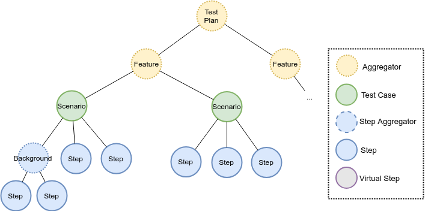

# Wakamiti::CORE

## Overview

## Test Plan

The test plan is the main piece of an execution. It is built according to a set of test definition sources 
(e.g., Gherkin files) and a configuration (e.i. a set of valued properties). From a topological view, 
a test plan is just a tree of nodes of different categories:

| Node type       | Description                                                   | Children node types                 | Rearrange | Walk order |
|-----------------|---------------------------------------------------------------|-------------------------------------|-----------|------------|
| Aggregator      | Node that aggregates other nodes                              | Aggregator, Test Case               | yes       | free       |
| Test Case       | Node representing an atomic test case                         | Step Aggregator, Step, Virtual Step | no        | strict     |
| Step Aggregator | Node representing a subset of steps within a test case        | Step Aggregator, Step, Virtual Step | no        | strict     |
| Step            | Node representing an executable step within a test case       | --                                  | --        | --         |
| Virtual Step    | Node representing an _non_-executable step within a test case | --                                  | --        | --         |

For example, for a traditional Gherkin feature file, the built test plan would correspond 
to the following diagram:

The idea of representing the test plan as a tree of nodes allows adapting the original resulting plan 
prior to execution, by applying regular graph transformations during a `plan redefinition` stage.

## Usage

The regular use of Wakamiti is via one of the launchers available: the Wakamiti JUnit Runner,
the Wakamiti Maven plugin, and the Wakamiti stand-alone launcher. This document focus on the 
first one, if you require information about any of the other two check their corresponding
documentation page.

  
### Launching Wakamiti programmatically

## Plugin development